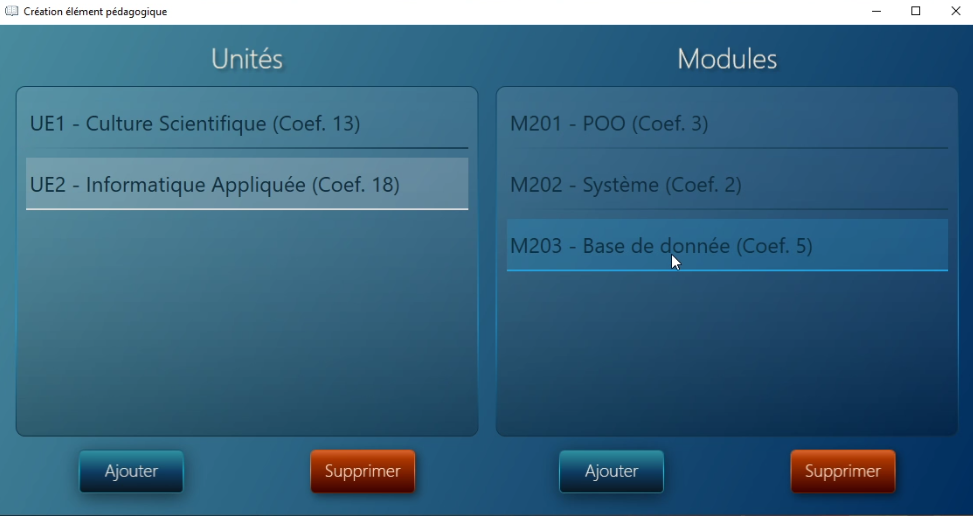
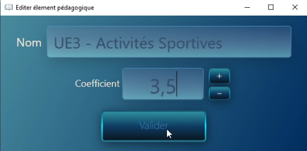
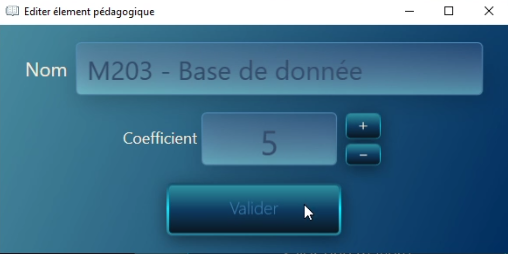
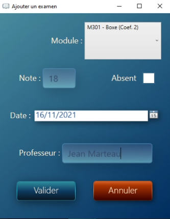
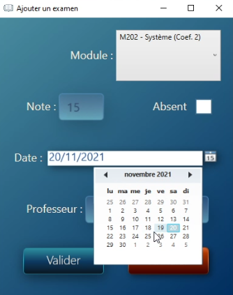
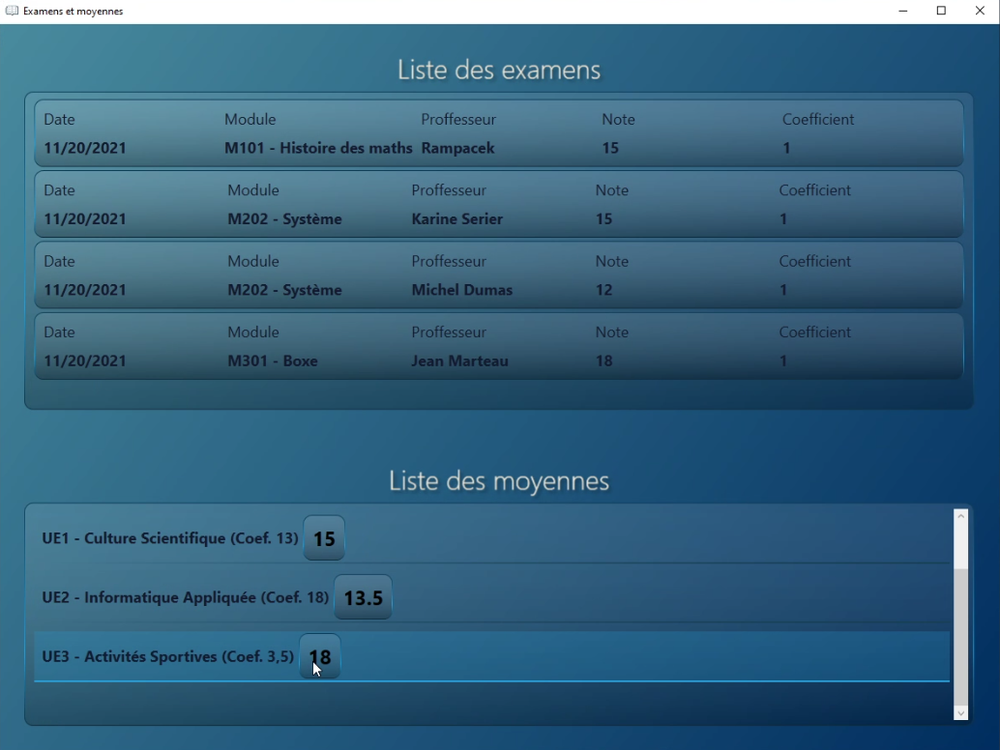
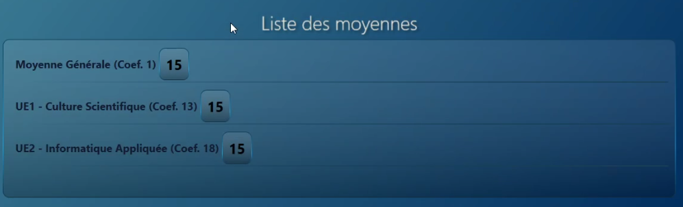

<h2> ❓ Qu'est ce que Notebook ❓ </h2>

Notebook est un logiciel qui à un étudiant pour saisir ses différentes notes et calculer sa moyenne générale et par unité d'enseignement. L’application est déployé
sur PC/Windows (7 ou +).

*<b> ⚠️ Ce projet a été dévelloppé dans un cadre pédagogique lors du notre 3ème semestre à l'IUT Informatique de Dijon-Auxerre.
Les droits associés appartiennent à l'IUT de Dijon-Auxerre. </b>*
  
 
<h2> 🖱️ Les technologies utilisées </h2>
<b> ➡️ EDI & Softwares: </b> Visual Studio 2019, .Net Framework, WPF 
   
<b> ➡️ Langages: </b> C#  
<b> ➡️ Serialisation: </b> JSon  
<b> ➡️ Deploiement: </b> Visual Studio Project Setup  
  

# Les fonctionnalités principales

<h2> Ajout d'unité et de modules </h2>
L'étudiant utilisateur à la possibilité de créer et de modifier des unités et des modules associés à ces unités d'enseignement.
• Un module est un élément pédagogique et est placé dans une unité d’enseignement
• Une unité d’enseignement est un élément pédagogique et regroupe un certain nombre de
modules

<h2> Ajout d'un examen et listage des moyennes </h2>
  Un étudiant peut ajouter un examen en l'associant à un module.
Il peut présicer la date de l'examen, le professeur qui a donné le contrôle.

<h2> Persistance et deploiement de l'application </h2>
  L'application est déployée sur Windows 7 ou +. Un système de serialisation Json permet de stocker les données.

  

# 🧰 Quelques captures d'écran

<h2> Fenêtre maîtresse de l'application </h2>
  
  
<h2> Ajout d'unités et de modules associés </h2>
 
 

  
  

  
<h2> Ajout d'examens </h2>
 

  
  

 
 <h2> Affichage des examens et des moyennes </h2>
  
  

